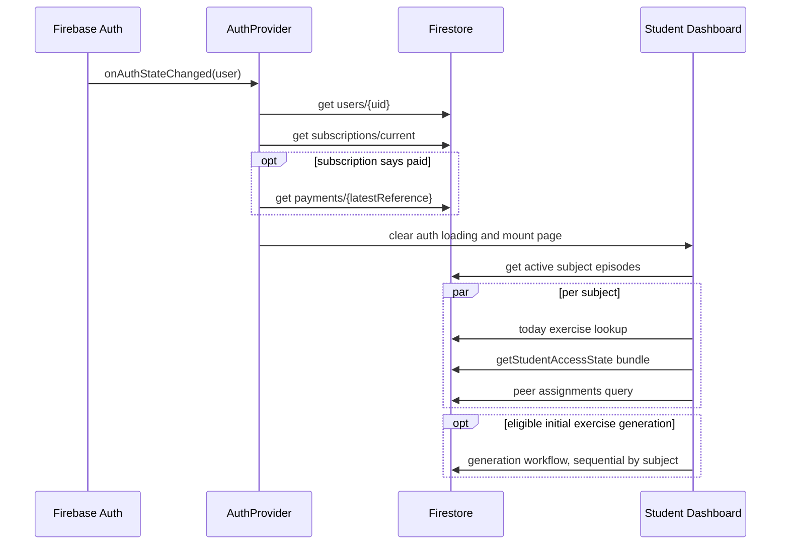
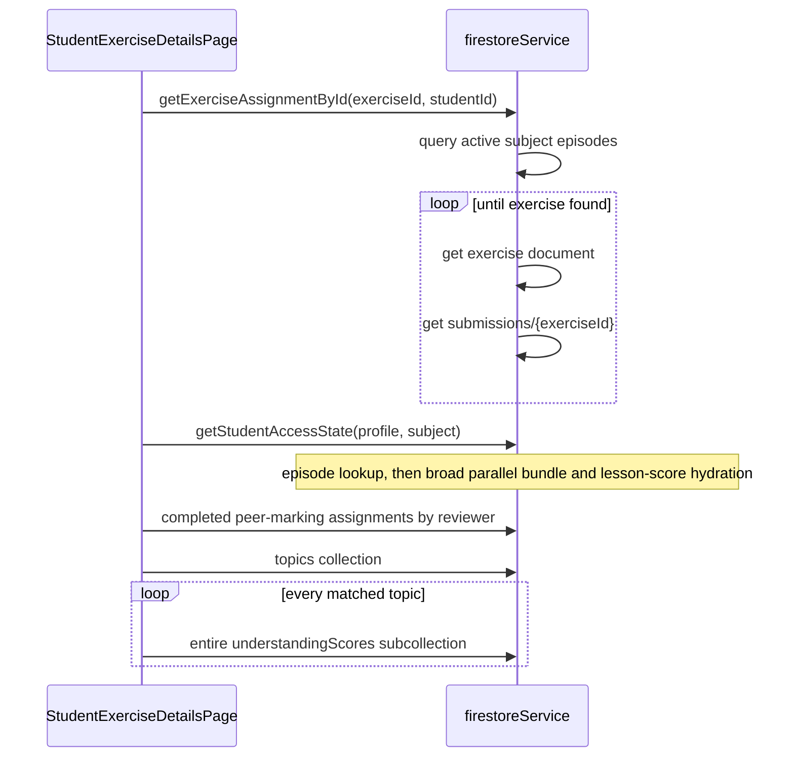
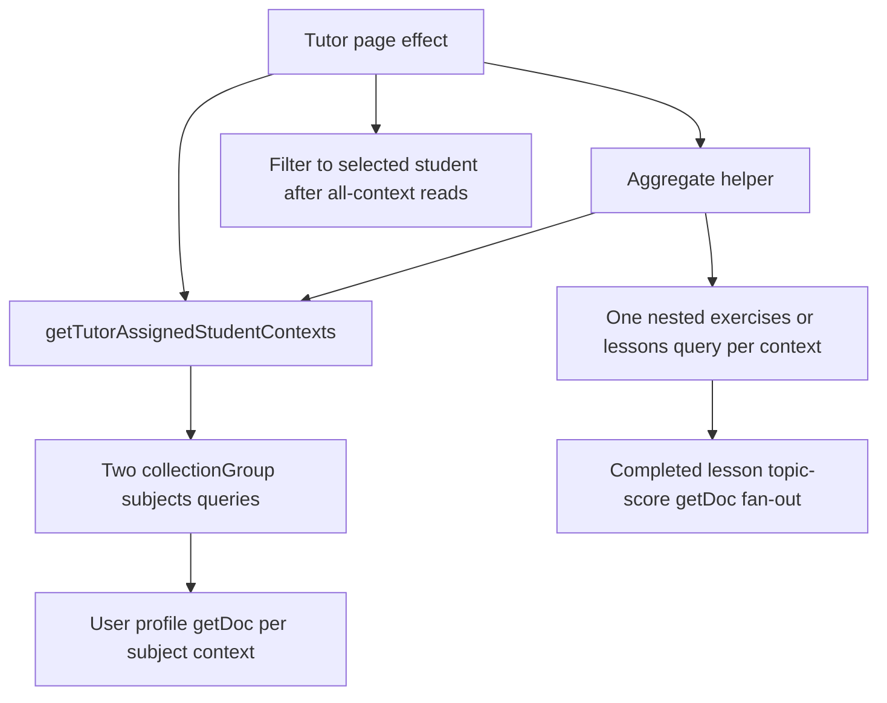

# Examifying Performance & Caching Audit

**Scope:** Read-only static inspection of the current React/Vite and Firebase implementation. No application code, packages, Firestore data, security rules, Storage rules, hosting, or Functions were changed. This audit does not include production traces or timed measurements, so it identifies code-proven query patterns and likely causes; it cannot assign measured milliseconds to an individual request.

## 1. Executive summary

The code has no shared page-data cache. Most pages keep Firestore results in component-local state and fetch again from `useEffect` when a route mounts or a selection changes. Leaving a page and returning therefore repeats its reads. Auth profile data is kept in the `AuthContext` during a session, and subscription state has a small in-memory store, but most services bypass that store.

The most consequential patterns are:

1. `getStudentAccessState()` is an expensive composite loader. Student pages that only need `paymentCompleted` call it anyway. It resolves a subject episode, then loads profile, subscription, question papers, reports, lessons, exercise history, generation status, and topic summaries. It hydrates completed lessons by reading one score document per lesson-topic. In one student-context path it also reads the same episode again through three helper functions.
2. Student exercise detail is a sequential chain: locate the exercise (sometimes by enumerating active subject episodes), read the exercise and submission documents one after another, load the broad access bundle, load completed marking assignments, then read every score under each matching topic. The page already has the episode ID available in list rows but does not include it in the student detail URL.
3. Tutor pages repeatedly load the same assigned-student contexts. The context helper runs two collection-group queries and then reads a user profile for every student-subject context. List pages often call that helper directly while another helper independently calls it again. Tutor student detail loads exercises and lessons for **all** assigned contexts before filtering to the selected student. Lesson hydration then fans out into per-topic score-document reads.
4. Several list paths read unbounded nested collections: tutor lessons/reports, student lessons, history periods, topic score subcollections, and Admin workspace data. Some reads are appropriately limited already, such as today/history exercise queries.
5. Parent dashboard enrichment calls the broad access bundle for every linked child, then loads that child's today exercise. The parent display only uses entitlement fields, a completed-lesson count, and today's exercise.
6. Security rules do perform cross-document authorization checks, including profile, episode, subscription, exercise and marking-assignment reads. Repeated paths may be cached by Firebase during an individual rules evaluation. Static inspection cannot show that rules explain the reported 3–10 seconds; repeated client requests, sequential dependencies, unbounded results and per-document fan-out are more directly evident in the application.

The subject-under-user hierarchy is intentional and should remain. The best first steps are to remove duplicate context/episode reads, pass known subject-instance IDs to detail routes, split narrow entitlement checks from generation readiness, and constrain/paginate broad list reads. Then add TanStack Query around pure read functions, use cached data immediately with a background refresh, and invalidate after confirmed writes. Firestore and authorized server functions remain authoritative.

## 2. Current data architecture

The data model is nested by user and subject episode:

```text
users/{uid}
  subscriptions/current
  payments/{reference}
  subjects/{subjectInstanceId}
    topics/{topicKey}
      understandingScores/{scoreId}
    lessons/{lessonId}
    reports/{reportId}
    generationRuns/{dateKey}
    exercises/{exerciseId}
      submissions/{submissionId}
      peerMarkingAssignments/{assignmentId}
      peerReviews/{reviewId}
```

There are also global/reference collections for question papers, subjects and grades, topic mappings, settings, discount codes and related admin data. The `subjectInstanceId` identifies an episode and its preserved history. Cancelled/archived subject episodes are meaningful historical records; do not flatten or delete them to improve reads.

Client-side Firebase reads/writes are centralized mainly in `src/services/firestoreService.js`, with authentication in `src/services/authService.js`, uploads in `src/services/storageService.js`, and payment callables in `src/services/paymentsService.js`. Privileged or multi-document operations also use callable Functions; Admin SDK calls in Functions are not evaluated against client Firestore rules and must retain their own authorization checks.

## 3. Current data-fetching architecture

- `src/main.jsx` mounts one `AuthProvider` around the router. `src/hooks/useAuth.jsx` listens to Firebase Auth, fetches the user profile, and stores it in context. Most page data then lives in local `useState` and is loaded in page effects.
- Pages call exported read functions in `firestoreService.js` directly. There is no common cache, request deduplication layer or page-data invalidation mechanism. Most reads rerun when a page mounts, or when a state dependency such as selected subject changes.
- `studentSubscriptionStateStore.js` is a module-level in-memory cache with in-flight deduplication and a default 30-second age in auth/route callers. It is not persistent across reloads. `getStudentAccessState()` and other page/service calls fetch entitlement information separately instead of consistently using that store.
- A few `onSnapshot` listeners are used for the tutor roster and exercise-generation status. They are scoped and unsubscribed by their consumers. The peer-marking subscription helper exists, but the reviewed student dashboard and peer-review page use one-shot reads. There is no general listener on every page collection.
- `React.StrictMode` is enabled in `src/main.jsx`. Development Strict Mode can replay effects and inflate local development request counts; that is not evidence that production users receive the same duplicate mount reads.

## 4. Major performance bottlenecks

- Broad loaders are reused where a narrow value would do. The clearest case is using `getStudentAccessState()` as an entitlement boolean on exercise, peer-review and parent pages.
- Query dependencies are often serialized even when independent. In particular, detail resolution may need an episode before it can read the exercise, and some detail pages wait for access or marking assignment data before requesting topic scores.
- Repeated helper composition reloads the same context document set. The page and each aggregate service independently call `getTutorAssignedStudentContexts()`.
- Nested collection reads multiply by active subject episodes, assigned students, lessons and topics. Several `Promise.all()` calls reduce elapsed time versus a strict serial loop, but they still make a large request/read fan-out and transfer all returned documents.
- Some queries are well constrained, while other code filters after download. `getQuestionPapers()` filters grade and region in JavaScript after querying by subject; some marking queries fetch across all subjects and filter locally.
- A one-shot Firestore read is repeated on route remount because local page state is lost. A cache would improve return navigation, but it would not fix the first-load fan-out or oversized queries by itself.

### Current patterns to preserve

- Keep the nested subject-episode hierarchy and historical episodes. Query the needed episode and child collection directly rather than flattening or deleting history.
- Keep the student exercise date windows and limits already used by `getTodayExercises()`, `getExerciseHistory()`, `getCurrentWeekExercises()` and `getFutureExercises()`.
- Keep independent reads in `Promise.all()` when their inputs are already known. The issue is duplicated inputs or excessive result sets, not parallelism itself.
- Keep the small, scoped generation-status and tutor-roster listeners where live status/roster behavior is required, and keep their unsubscribe paths.
- Keep direct `getDoc()` reads for known document IDs and current await-confirmed writes. Do not replace them with broad collection queries or optimistic success UI.
- Keep Admin/callable authorization checks, topic/score source distinctions, and history-access checks even when the frontend begins using cached display data.

## 5. Query waterfall map

### Student login and protected Home



`loginWithEmail()` / Google sign-in also fetches the profile after Firebase Auth succeeds, while the auth-state listener independently fetches it. Subscription calls are in-flight deduplicated in the custom store, but the profile reads are not. `AuthProvider` waits for student subscription loading before clearing global auth loading, so even routes that do not require a paid plan wait for that check before rendering.

### Student exercise detail



The exercise lookup and submission reads are serialized. The later topic-score fetch is also a full topic query followed by reads of every score document for matching topics.

### Tutor roster, dashboard and Student Details



`TutorExercisesPage`, `TutorLessonsPage`, `TutorReportsPage` and `TutorDashboardPage` can independently fetch contexts in parallel with a service that fetches those same contexts again. `TutorStudentDetailsPage` adds a history-context query, then requests all assigned students' exercises and lessons before selecting the one student. Returning to one of these pages starts the local effects again.

## 6. Repeated/duplicate Firestore reads

| Pattern | Evidence | Effect |
|---|---|---|
| Profile read after login | `authService.js` email/Google flows call `getUserProfile`; `useAuth.jsx` also calls it from `onAuthStateChanged` | Two independent profile reads can occur during sign-in. The Auth SDK event and page flow can overlap, but do not share profile request state. |
| Repeated subject episode resolution | `getStudentAccessState()` resolves an episode, then concurrently calls reports, completed lessons and assignment history with its ID. Those helpers each invoke `getActiveSubjectEpisode()` again; with the ID, this is still a direct `getDoc` of the same episode. | At least three duplicate episode-document reads inside a single access-state computation, in addition to the initial active-episode query. |
| Dashboard per-subject bundle overlaps other loads | `StudentDashboardPage.jsx` separately calls `getTodayExercises()` and `getPeerMarkingAssignmentsForStudent()` while `getStudentAccessState()` also loads assignment history, lessons, reports, topic summaries, generation state and entitlement information. | Useful outputs are fetched through separate overlapping paths; initial rendering waits for the access-state promises. |
| Full access bundle reused as a boolean | Student exercise detail, exercise list and peer-review page only need an entitlement result from `getStudentAccessState()`. Parent dashboard also calls it per child. | Fetches unrelated reports, lessons, exercise history, papers, topics and score documents. |
| Tutor context loaded in both caller and helper | Tutor exercise/lesson/report list pages and dashboard call `getTutorAssignedStudentContexts()` alongside helpers that themselves call it. Student details calls it while exercise/lesson helpers each load their own contexts. Tutor exercise details does the same while `getStudentTopicScoresForTutor()` calls `requireTutorAccess()`, which reloads contexts. | Repeats both collection-group queries and profile fan-out, then often downloads all-context rows only to filter the selected student. |
| Profiles repeated by subject/period | Context and history helpers fetch one `users/{studentId}` document for every episode/period row, without deduplicating student IDs first. | Students with several active subjects or historical periods cause repeated reads of the same profile within one helper call. |
| Detail score fetch reads irrelevant score history | `getTopicUnderstandingQuestionScores()` reads all topic docs, then all documents in each matching topic's `understandingScores` collection; page filters source/activity only after retrieval. | Old lesson/exercise/marking events and unrelated exercise events can be transferred for a single detail page. |
| Peer assignment scope filtered locally | `getPeerMarkingAssignmentsForStudent()` and `getCompletedPeerMarkingAssignmentsForStudent()` filter by reviewer/status in Firestore but not `subject`; completed rows additionally require images in JavaScript. | Extra subject rows are read. Subject is known by the callers. |
| Roster listener triggers refetch | `subscribeToAssignedStudentsForTutor()` listens to active staff contexts and, on each snapshot, calls `getAssignedStudentsForTutor()`, which issues two fresh context queries and profile reads. | Keeps the live behavior, but the callback re-fetches an overlapping collection-group roster rather than updating a shared roster cache from the listener snapshot. |

## 7. Firestore and Storage security-rule performance findings

### Confirmed performance issue

The client code issues repeated, sequential or broad reads as described above. These are explicit application requests visible in the source and do not depend on a theory about rules latency.

### Possible issue

`firestore.rules` helpers call `get()` on user profiles (`profile()`), subject episodes (`episode()`) and subscription documents (`hasPaidAccess()`). Exercise submission rules can also read the exercise document. `storage.rules` reads the requesting user's profile for admin checks, episode, exercise and, for submission reads, a peer-marking assignment existence path. Those authorization dependencies can add billed document-access calls to the relevant reads/writes/uploads. `hasPaidAccess()` repeats `exists()`/`get()` against the same subscription path, and several helpers read the same episode path; Firebase documents that some repeated rule access calls can be cached within an evaluation and that access-call limits apply. **No `getAfter()` call appears in the inspected Firestore or Storage rules.** Static source inspection does not measure incremental latency. See [Firestore rules conditions and access-call limits](https://firebase.google.com/docs/firestore/security/rules-conditions) and [Cloud Storage rule conditions using Firestore](https://firebase.google.com/docs/storage/security/rules-conditions).

### Unlikely to be a significant explanation for broad page waits

Rules are evaluated on requested operations; they do not create the client-side `getDocs()` fan-out or the serial `await` dependencies. Repeated `episode()` references often point to the same episode in a single evaluation, and subscription checks point to the same subscription document, where Firebase documents possible call caching. There is no code evidence that the rules alone account for 3–10 seconds on Home, exercise lists or tutor detail pages. Do not weaken or rewrite authorization rules as a performance shortcut. Measure query count/latency first and keep server-side entitlement and staff-role verification authoritative.

No rule changes are proposed in this audit.

## 8. Role-by-role findings

### Student

- **Login/Home:** `AuthProvider` performs profile and subscription work before route availability. `StudentDashboardPage` first loads active subjects; after that it starts today's exercises and peer assignments, and runs `getStudentAccessState()` for every subject. That broad bundle includes generation readiness data. It then may run initial generation sequentially for eligible subjects. The full screen displays an access-check loading state while that process runs.
- **Subjects:** `ProfileSubjectsPage` independently loads active user subjects, global subjects, subject-history options, and other role-specific data. Global subject list is a small, relatively stable catalog; it is refetched on page remount. Subject history is a callable and should be cached only according to its student/grade inputs and freshness need.
- **Exercises:** `StudentExercisesPage` reloads the active subject list when selected subject changes, then waits for the broad access bundle before starting today's exercise and history reads. The service already constrains today's exercises and history with date filters and limits, which is appropriate.
- **Exercise details:** Exercise resolution, access state, marking assignments and question scores form the serial chain above. Include the known `subjectInstanceId` in the route/query state and use a narrow entitlement read for page gating.
- **Lessons:** `getLessonsForStudent()` gets all active episodes, all lessons for each episode without a status/date/limit constraint, then hydrates completed lesson scores using one direct score-document read per lesson-topic.
- **Peer marking:** `StudentPeerReviewsPage` loads active subjects; on subject selection it concurrently loads broad access state and all assigned marking rows across subjects, then filters to the chosen subject. Uploads themselves correctly wait for each Storage upload and the completion callable.

Student billing uses the subscription-state store for its billing panel, but payment completion then walks active subjects and awaits broad `getStudentAccessState()` and potentially exercise generation per subject in sequence. Keep generation outside cached query functions and measure this post-payment workflow separately; it performs writes/work rather than only loading a page.

### Profile/account pages

`ProfileHubPage` uses the already-loaded auth profile for identity and navigation, and student subscription state comes from the custom store. `ProfilePersonalDetailsPage` uses auth-context fields for the form, but may call the subject-history callable when a student edits grade and the tutor WhatsApp-settings callable for tutors. `ProfileSubjectsPage` launches active-subject, global-subject and history-option reads independently for students; tutors also load marks documents and WhatsApp settings. These reads are generally independent and need not block one another. `ProfileSettingsPage` initializes from the auth profile and fetches profile again only after a confirmed save. The legacy `StudentProfilePage` also uses auth context plus the subscription store, without a separate profile fetch. Tutor `ProfileBillingPage` loads `getTutorBillingSummary()`, which currently loads all tutor lesson collections and score hydration; it should eventually use a bounded billing summary or cached tutor lesson data.

### Tutor / Teacher

Teacher routes reuse the tutor components and role context. The current assigned-context query merges active staff contexts and primary-tutor contexts, deduplicates episode paths, then fetches profiles per subject context. The two broad collection-group queries are parallel, but each service consumer repeats the helper call.

Tutor dashboard reads contexts and all tutor lessons; each helper loads contexts separately. It then fetches question papers per unique subject/grade/province and subscription state per unique student. Tutor student list uses a live roster listener, but every roster snapshot triggers new roster queries/profile reads. Tutor exercise and report pages load all assigned data before applying UI filters.

Tutor Student Details performs historical-context loading first. In the active path it then concurrently requests contexts, exercises and lessons, each aggregate path repeating context discovery. It filters exercise/lesson rows only after those reads, then requests paper/topic information, staff, peer-marking work and other details. Archive routes intentionally fetch the selected episode's full history and should retain it, but can paginate large history displays.

Access-role information (`co-owner`, `marker`, `viewer`) is computed from episode fields and used by UI. It should be cached briefly for responsive display, but any callable or write that changes/scores student data must continue to enforce current permissions on the trusted backend/rules side.

### Parent

`ParentDashboardPage.loadStudents()` first gets linked student profiles, then for every child awaits broad `getStudentAccessState()` and afterward `getTodayExercise()`. The access bundle performs independent episode, user, subscription, paper, report, lesson, history and topic reads, although the parent row consumes entitlement fields and a completed-lesson count. The child profile is fetched again inside the broad state function. A future parent summary query should return exactly the UI's needed fields and use the same student-scoped cache keys. Parent profile edits already wait for `updateDoc()` success before reloading.

### Admin

Admin Dashboard starts the callable workspace request and generation-warning query separately. In `functions/src/adminWorkspace.js`, the dashboard/tutor/assignment scopes read all users and the full `collectionGroup('subjects')`; dashboard then reads all payment documents to show the newest eight and a count. The guide-results scope reads all users and all guide result documents. These are full collection scans and a sequential callable waterfall after admin verification. Cache reuse can reduce repeat visits but will not solve first-load scaling; add server-side filtering, aggregation/counts, narrow projections and pagination in a later, separately measured change.

### Editor / viewer / co-owner / marker access

These access roles are represented on tutor/student episode documents and flow through the common tutor contexts and detail pages; they are not separate login roles in the route table. Consequently they incur the same broad context reads. Viewer detail pages should avoid loading data/actions they cannot use if the UI can identify this safely, but authorization decisions must still be enforced by backend/rules. Co-owner and marker writes should not trust cached context for authorization.

## 9. Subscription caching analysis

Current behavior:

- `getStudentSubscriptionState()` reads `users/{studentId}/subscriptions/current`, and if the state claims payment is complete, reads `users/{studentId}/payments/{latestReference}` to verify consistency with the plan quote. This is intentionally stronger than trusting profile fields.
- `studentSubscriptionStateStore.js` keeps in-memory state by UID, shares an in-flight request and supports forced refresh. Auth/route calls use a maximum age of 30 seconds. Reloading the page loses the cache.
- `AuthProvider` awaits this load before setting `loading: false`. This makes subscription verification part of every student protected-route startup, not just a subscription-gated route.
- `getStudentAccessState()` reads the subscription document itself and verifies the referenced payment again, independently of the store. The broad service is called on Home and in multiple student pages.
- Payment flows go through callable Functions. After payment verification or subscription management, callers refresh profile/subscription state.

Recommended future policy:

- Use a UID-scoped `['student', uid, 'subscription']` query with cached state available immediately and a short `staleTime` (30–60 seconds). Background-refetch on route entry when stale, window focus and reconnect. Keep a fresh verification path for payment-return handling and explicit subscription changes.
- Keep `subscriptions/current` and its referenced payment verification in the query function or in a narrowly scoped entitlement service; do not trust a cached boolean for server-side actions. Cache age affects the displayed/gating UI only. Protected callable Functions, security rules, and subscription mutations must check current authoritative records.
- On successful payment verification, renewal, cancellation, retry or plan/subject-count change, await the server result and force-refetch/update the subscription query. Clear all user-scoped cache on logout/account switch.
- Decouple general auth/profile route startup from waiting for the subscription query. A paid-only route can render cached subscription state and show its own narrow refresh/loading state if no cache exists; avoid blocking student Home on the full payment-reference verification. Preserve the current server-side enforcement.

## 10. TanStack Query implementation recommendation

TanStack Query is a good fit for repeated one-shot reads and navigation return paths, after query functions are separated from side effects. Introduce one `QueryClientProvider` at the application root, scope every key by UID and subject episode, return plain serializable/read-only data, and let cached results render immediately while stale queries refresh in the background.

Important boundary: `StudentDashboardPage` calls `generateExercisePlanIfEligible()` as part of loading. Exercise generation is a mutation/workflow with writes and callable/model work, not a query function. Keep it outside query retries and cache refetches. Trigger it only under existing eligibility logic, await its result, then invalidate affected exercise and generation-status queries.

Use a small retry policy for network/transient failures only; do not repeatedly retry permission-denied, validation or not-found responses. Avoid persisting sensitive student/profile/subscription data to local storage in the first rollout. Clear query data when the authenticated UID changes and on logout. Keep the existing generation/roster listeners where live updates are actually needed; either feed listener snapshots into the matching query cache or invalidate that key, and always unsubscribe.

## 11. Proposed query-key/cache structure

Use stable IDs and complete filter inputs in keys. Never key private data only by a display subject string.

```js
['user', uid, 'profile']
['student', uid, 'subscription']
['student', uid, 'subjects', 'active']
['student', uid, 'subject', subjectInstanceId, 'summary']
['student', uid, 'subject', subjectInstanceId, 'exercises', { range, dateKey, cursor }]
['student', uid, 'subject', subjectInstanceId, 'exercise', exerciseId]
['student', uid, 'subject', subjectInstanceId, 'lessons', { status, cursor }]
['student', uid, 'subject', subjectInstanceId, 'reports', { cursor }]
['student', uid, 'subject', subjectInstanceId, 'topics']
['student', uid, 'subject', subjectInstanceId, 'question-scores', { sourceIds, topicKeys }]
['student', uid, 'peer-marking', { subject, status }]
['tutor', tutorUid, 'contexts', { subject, status: 'active' }]
['tutor', tutorUid, 'student', studentUid, 'subject', subjectInstanceId, 'detail']
['tutor', tutorUid, 'exercises', { studentId, subject, cursor }]
['tutor', tutorUid, 'lessons', { studentId, subject, status, cursor }]
['tutor', tutorUid, 'reports', { studentId, subject, cursor }]
['parent', parentUid, 'students']
['parent', parentUid, 'student', studentUid, 'summary']
['catalog', 'subjects']
['catalog', 'topics', subject, grade]
['question-papers', { subject, grade, region, analyzedOnly, cursor }]
['admin', 'workspace', scope, { subject, cursor }]
```

Suggested initial freshness and behavior:

| Data | Suggested `staleTime` | Safe immediate cached rendering? | Refresh / invalidation |
|---|---:|---|---|
| Auth profile, role and display fields | 5 min | Yes for same authenticated UID; role cache is UI state only | Background on stale mount/focus; invalidate after profile, role, grade or subject writes; clear on UID change/logout |
| Subscription/entitlement | 30–60 sec | Yes for prompt UI, but treat as provisional until refreshed for sensitive decisions | Background on stale mount/focus/reconnect; force refresh after payment/renew/cancel/retry/plan changes |
| Tutor/student relationships and access-role contexts | 30–60 sec | Yes for roster/detail display | Refresh on focus; invalidate on assignment, grant/revoke, grade/subject or relationship changes; server rechecks on writes |
| Active subject lists | 2–5 min | Yes | Background on stale mount; invalidate after add/remove/restore/availability/grade or subscription subject-count change |
| Global subjects/topic catalog | 30–60 min | Yes | Refresh periodically or after admin catalog/mapping changes |
| Student today exercise and assignment status | 15–30 sec | Yes, with stale indicator if helpful | Refresh on focus/reconnect and date boundary; invalidate after generate, submit, tutor update/delete |
| Exercise history and tutor lists | 1–2 min for first page | Yes | Cursor-paginate; invalidate after generation/submission/delete/assignment changes |
| Exercise detail, submission metadata, marking metadata | 30–60 sec | Yes for display; do not use cache as authorization | Refresh on stale entry; invalidate after submission/marking/tutor update/delete |
| Topic summaries and individual question scores | 30–60 sec | Yes for viewing scores; an unsaved tutor edit remains local draft | Invalidate after score/lesson/marking/topic changes; never treat cached value as a saved score |
| Completed/planned lessons and reports | 1–2 min | Yes, paginate larger lists | Invalidate on lesson create/update/complete/roster/cancel and report save |
| Question papers | 5–15 min for filtered lists | Yes; analysis state can change | Invalidate after upload/edit/analyze/cancel; keep admin analysis activity live only while open |
| Admin aggregate/workspace | 30–60 sec after server query is narrowed | Yes for dashboard/roster overview | Refresh after admin assignment/payment/account changes; cache cannot replace server pagination/aggregation |
| Upload progress, current entitlement-sensitive mutation, permission check | Do not cache as a success result | No; only local draft/progress is immediate | Always await Storage/Firestore/callable confirmation |

These are starting values, not claims about observed production update rates. Validate them against actual write frequency and product expectations during rollout.

## 12. Write/mutation strategy

The existing code generally awaits critical commits/callables before displaying success, which is the right reliability foundation:

- Exercise upload validates the exercise, uploads all pages, commits a Firestore batch to the exercise and submission documents, and only then returns. `SubmissionUpload` awaits this result before showing submitted status. Image analysis is deliberately detached and should remain a non-blocking enrichment task.
- Peer marking uploads images then awaits `completePeerMarkingAssignment` before clearing the assignment.
- Tutor marking/understanding scores use callable Functions; lesson writes use transactions, batches or callables; subject and assignment changes use Functions; parent profile writes await Firestore. Payment initialization/verification is callable-based.

Future mutations should follow:

```text
local draft/progress
  -> Saving / Uploading / Submitting state
  -> await Storage + Firestore batch/transaction or callable
  -> on confirmed success: update or invalidate related query keys
  -> show success
  -> on failure: preserve draft, show error, do not claim success
```

Safe optimistic behavior is limited to local presentation state: selected filters, open panels, form drafts, upload progress, or a clearly reversible local toggle that is rolled back on failure and is not used for entitlement/authorization. Do not optimistically mark a submission as accepted, a peer assignment as completed, a tutor score as saved, a lesson/quota as updated, a subject as active, or a payment as paid. For uploaded images, do not cache Firestore success before every required upload and the confirmed document/callable write succeeds.

## 13. Cache invalidation strategy

| Confirmed operation | Invalidate/refetch |
|---|---|
| Exercise generation/regeneration | Student/tutor exercise lists for that episode; today/history ranges; generation-run status; readiness summary |
| Student submission | Exact exercise and submission metadata; today's exercise; tutor exercise/detail lists; any assigned peer-marking list affected by backend assignment creation |
| Peer-marking upload/completion | Reviewer peer-marking list; reviewee exercise/detail and peer-marking work; affected topic score/understanding summary after tutor score |
| Tutor exercise score or peer-marking score | Exact exercise/marking detail; question-score key; topic summary; student/tutor dashboard score summaries |
| Lesson create, edit, complete, roster update or cancellation | Affected episode lesson pages; topic summary/scores; tutor context/quota data where returned; eligibility/readiness and any exercise generation state affected by completion |
| Subject add/remove/restore or grade change | Profile; active subjects; current and historical subject options; episode keys; tutor contexts/rosters; subject-specific exercise, lesson and summary keys |
| Tutor assignment/access-role grant/revoke | Tutor contexts; student/tutor detail; roster and subject summaries. Backend write authorization must be fresh regardless of cache. |
| Subscription/payment mutation | Student profile fields if changed; subscription/entitlement key; subject count/active subject list; parent child summary; any subscription-sensitive dashboard state |
| Profile/settings update | Profile key; role-specific profile/settings query; do not invalidate unrelated exercise history |
| Question paper upload/edit/analyze/cancel or topic mapping update | Filtered question-paper keys; global topic-option/catalog keys that depend on papers/mappings; readiness cache where used |

Prefer invalidating the narrow episode-specific keys rather than clearing the entire client after every mutation. Clear all user-scoped cache when logging out or switching authenticated users.

## 14. Prioritized findings

### P0 — Fix the first-load dependency chains

#### P0.1 Student entitlement is blocking and over-fetches

- **Affected:** `src/hooks/useAuth.jsx:32-42`; `src/services/studentSubscriptionStateStore.js`; `src/services/firestoreService.js:989-1051,1053-1198`; `src/pages/student/StudentDashboardPage.jsx:157-209`; `StudentExercisesPage.jsx:34-41`; `StudentPeerReviewsPage.jsx:34-45`; `StudentExerciseDetailsPage.jsx:20-47`.
- **Current behavior:** Student auth waits for subscription state (and paid-state payment verification) before clearing global loading. Multiple pages then call `getStudentAccessState()`, even when only a boolean is needed. That function reads episode and broad related data and performs extra direct episode reads via helpers.
- **Why inefficient:** Auth→subscription→payment is a startup waterfall. Access-state callers duplicate that work and wait on lesson score hydration and other data unrelated to page access.
- **Recommended change:** Separate a narrow entitlement query from generation/readiness bundle; centralize it under the UID-scoped cache. Render profile and cached state while stale entitlement refresh runs in the background. Keep generation readiness separate and keep generation itself outside query functions.
- **Expected benefit:** Protected student pages and return visits can render sooner, with fewer repeated reads and less work before an access decision.
- **Risk/dependencies:** Medium-high because route gating and payment semantics are sensitive. Requires explicit tests/manual validation of expired, past-due, paid, free and offline paths; no frontend cache may become the authority for callable/rule checks.
- **TanStack Query:** High relevance; this is the primary stable-data cache target.

#### P0.2 Student Exercise Details serializes avoidable reads and fetches all topic score history

- **Affected:** `src/pages/student/StudentExerciseDetailsPage.jsx:18-58`; `src/pages/student/StudentDashboardPage.jsx:421`; `src/services/firestoreService.js:2329-2431`.
- **Current behavior:** Student detail route carries only the exercise ID. Lookup scans active episodes and then sequentially fetches exercise/submission docs. It awaits the broad access bundle, then marking assignments, then all score documents in matching topic subcollections.
- **Why inefficient:** Multiple serial network dependencies precede a complete view; score query transfers historical records and filters them after download.
- **Recommended change:** Pass `subjectInstanceId` with the known exercise ID and use direct episode/document paths. Load the exercise and narrow access state independently in parallel where possible. Query score records by relevant topic plus source IDs/source types, not entire score subcollections; add indexes only after validating query shape and index requirements. Keep the nested subject hierarchy.
- **Expected benefit:** Removes episode discovery on known-detail navigation, shortens the request chain and cuts irrelevant score-document reads.
- **Risk/dependencies:** Medium. Confirm old exercise routes without query context retain a safe lookup fallback; preserve all sources needed for displayed tutor/question scores and peer-marking history.
- **TanStack Query:** High for caching direct exercise/access/marking reads; query scoping alone does not replace server filters.

#### P0.3 Tutor Student Details reads all students' nested data before filtering

- **Affected:** `src/pages/tutor/TutorStudentDetailsPage.jsx:99-197`; `src/services/firestoreService.js:3169-3210,3276-3308`.
- **Current behavior:** Student detail loads history contexts, then context/exercise/lesson aggregate helpers over every assigned student. Each helper reloads contexts; only afterward are rows filtered to the selected student. Lessons then hydrate per lesson-topic score docs.
- **Why inefficient:** This is broad fan-out on one frequently used student page; latency and reads grow with the tutor's roster, not just the selected student.
- **Recommended change:** Share one context result, select the authorized student/subject episode first, then load only that episode's exercise/lesson/report subcollections. Fetch historical data only for the selected period. Reuse the same relationship query/cache across components.
- **Expected benefit:** Detail cost scales with one learner and the selected subject episode instead of the full tutor roster.
- **Risk/dependencies:** Medium-high because active, co-owner/marker/viewer and historical access have separate visibility. Preserve exact access filtering and archived episode behavior.
- **TanStack Query:** High for context and episode detail reuse; query scoping/filtering is also required.

### P1 — High-value query-shape and fan-out improvements

#### P1.1 Repeated tutor context loads and profile N+1

- **Affected:** `getTutorAssignedStudentContexts()` and `getTutorAssignmentHistoryContexts()` in `src/services/firestoreService.js:3169-3210`; tutor dashboard/exercise/lesson/report pages.
- **Current behavior:** Two parallel collection-group queries are merged, then one user-profile read is issued per subject context; page and aggregate service often each invoke the helper. Primary-tutor query results are filtered for `status === 'active'` after download.
- **Why inefficient:** Duplicate collection-group requests and repeated profile reads grow by context count and recur on remount. Same student profiles may be read more than once for multiple subjects.
- **Recommended change:** Pass a shared context result to aggregate loaders or centralize context composition; deduplicate profile UIDs before reads; add `status == active` to the primary-tutor query if data semantics confirm it, with the needed index. Keep staff and owner result union until the episode invariants are verified.
- **Expected benefit:** Fewer repeated context/profile reads and less inactive episode transfer.
- **Risk/dependencies:** Medium. Must preserve access-role and membership history semantics; query changes may need composite indexes.
- **TanStack Query:** High for sharing, modest for first-load N+1 unless helper/query shape is also changed.

#### P1.2 Tutor/student lesson history is unbounded and score hydration is N×topics

- **Affected:** `getLessonsForStudent()`, `getTutorLessonsForAssignedStudents()`, `hydrateEpisodeLessonScores()` in `src/services/firestoreService.js:446-464,3285-3308`.
- **Current behavior:** Reads all lesson docs in each active/assigned episode, then gets every completed lesson's score document for each topic in parallel.
- **Why inefficient:** Read count scales roughly with lessons plus completed lesson-topic pairs, and student/tutor lesson lists have no paging limit or cursor.
- **Recommended change:** Paginate lesson lists by date/status while preserving history; load first-page rows first and hydrate details lazily or only for rows requiring score display. Check whether the lesson document's saved topic scores are sufficient before removing canonical score reads; otherwise add a narrowly filtered/batched server read while preserving the rollup source of truth.
- **Expected benefit:** Bounded initial list reads and reduced score fan-out.
- **Risk/dependencies:** Medium-high; lesson ordering, attendance, group-session aggregation and existing score consistency must remain intact.
- **TanStack Query:** High for cursor pages and row detail caching; not a replacement for reducing per-row score reads.

#### P1.3 Parent dashboard does expensive generation readiness work per child

- **Affected:** `src/pages/parent/ParentDashboardPage.jsx:79-110`; `getStudentAccessState()` and `getTodayExercise()`.
- **Current behavior:** Child profiles are followed by broad access-state loads and then today's exercise read, per linked child.
- **Why inefficient:** Access state fetches reports, question papers, history, lessons/topics and generation status not displayed by the parent dashboard. It repeats each child's profile read.
- **Recommended change:** Use a narrow child entitlement/current-subject/today-exercise summary, reuse child profile data, and load optional lesson counts separately or derive them from a count/summary where safe. Parallelize only independent reads after narrowing them.
- **Expected benefit:** Less work per child and a smaller wait as a parent's student count grows.
- **Risk/dependencies:** Medium; payment, subject coverage and child-parent authorization must remain verified.
- **TanStack Query:** High for per-child summary reuse and invalidation after parent/payment writes.

#### P1.4 Question-paper queries overfetch by subject

- **Affected:** `getQuestionPapers()` in `src/services/firestoreService.js:2086-2096`; tutor dashboard, student readiness, lesson/topic pages.
- **Current behavior:** Firestore query constrains only `subject`; `grade`, `region`, analysis status and national fallback are filtered client-side. Paper docs include analyzed question arrays and can be sizable. The same subject query is repeated by many consumers.
- **Why inefficient:** Transfers papers for other grades/regions and may repeatedly transfer large question payloads.
- **Recommended change:** After confirming existing region/national conventions, constrain by grade/region in Firestore, fetch national fallback separately as needed, and consider separating small list metadata from full analyzed question detail. Cache filtered catalogs and invalidate after paper analysis/change.
- **Expected benefit:** Less payload and fewer repeated subject paper reads.
- **Risk/dependencies:** Medium-high; national-paper fallback, topic extraction and generation must return identical paper eligibility. Add/verify composite indexes.
- **TanStack Query:** High for reusable filtered lists, but first-load benefit depends on Firestore-side filtering.

#### P1.5 Admin workspaces full-scan users, episodes and payments

- **Affected:** `functions/src/adminWorkspace.js:31-42,78-132,134-150`; `AdminDashboardPage.jsx`; `AdminUsersPage.jsx`.
- **Current behavior:** Dashboard/tutor/assignment calls read all `users` and all subject episodes; dashboard also reads all payments before sorting and taking eight. Guide results read all users/results. The callable first verifies admin, then performs these scans.
- **Why inefficient:** Data and server work scale with the entire database for one page; caches only help subsequent visits.
- **Recommended change:** Build bounded server-side queries, use count/summary aggregates for totals, order/limit recent payments at query time, and paginate user/episode results. Keep authorization in the callable. Do not move broad admin reads into the browser.
- **Expected benefit:** Admin first-load cost scales with requested page/scope rather than account history size.
- **Risk/dependencies:** High because totals, assignments and latest-payment summaries must remain accurate. This should be a separately validated Functions change after read-only audit.
- **TanStack Query:** Medium; helps repeat visits, but server query redesign is required for first load.

#### P1.6 Marking/topic score reads are unbounded and under-filtered

- **Affected:** `getTopicUnderstandingQuestionScores()` and peer-marking readers in `src/services/firestoreService.js:2287-2303,2407-2431`; `StudentPeerReviewsPage.jsx`; both exercise detail pages.
- **Current behavior:** Peer rows query by reviewer/status only and filter subject after reading. Question-score reader fetches topic collection then all score rows for every matched topic.
- **Why inefficient:** Reads grow with all completed historical score events and all subjects for that reviewer.
- **Recommended change:** Add known subject to peer query and index; derive relevant score source IDs from exercise/assignment rows and query only `sourceType`/`sourceId` records for the displayed activity, chunking IDs to supported query sizes. Consider storing a small detail summary only if existing source records cannot be queried efficiently.
- **Expected benefit:** Detail/peer pages transfer only scores and assignments they can display.
- **Risk/dependencies:** Medium-high; `Exercise` and `Marking` source distinctions and immutable score-event semantics must be preserved.
- **TanStack Query:** Medium-high; caching helps after scoping, but will not remove broad first reads alone.

#### P1.7 Tutor report and exercise lists scale with every assigned subject

- **Affected:** `getTutorReportsForAssignedStudents()` and `getTutorExercisesForAssignedStudents()` in `src/services/firestoreService.js:3260-3283`; `TutorReportsPage.jsx`, `TutorExercisesPage.jsx`.
- **Current behavior:** Each helper first loads all tutor contexts and then runs one nested collection query per context. Reports have no limit; exercises are limited to 40 per context but the aggregate has no page-level cap. The pages apply student/subject filters only after loading combined rows and separately load contexts again for filter controls.
- **Why inefficient:** Read count and payload grow with every assignment episode even when a tutor selects one student or subject.
- **Recommended change:** Share the context result, apply selected filters to context selection before reading child collections, and add cursor pagination to all-student views. Keep unfiltered results available through pagination when the tutor chooses “all”.
- **Expected benefit:** Lower initial list cost and selected-student pages scale with the selected context rather than the full roster.
- **Risk/dependencies:** Medium; sorting and filters must work consistently across pages, and historical report visibility must remain unchanged.
- **TanStack Query:** High for shared contexts and cursor pages; server-side scoping is needed for first-load savings.

### P2 — Useful optimizations after the first fixes

#### P2.1 Repeated route fetches and small catalogs

- **Affected:** page-local effects across `src/pages/**`; `ProfileSubjectsPage.jsx`; global subject/topic readers in `firestoreService.js:1837-1871`.
- **Current behavior:** Results are discarded at unmount; returning to Home, profile subjects, lessons or lists refetches them. Global subject and topic data changes infrequently.
- **Why inefficient:** Navigation repeats reads even when data remains fresh.
- **Recommended change:** Add TanStack Query after central query keys and invalidation are agreed. Use 30–60 minute freshness for global catalogs, shorter values for user lists, and preserve background refetch.
- **Expected benefit:** Immediate warm-cache return navigation and fewer repeated catalog/profile-list reads.
- **Risk/dependencies:** Low-medium once query functions are pure; cache leakage between accounts is a privacy/access risk unless UID-scoped and cleared on logout.
- **TanStack Query:** Directly relevant.

#### P2.2 Tutor assignment-history context and archive reads

- **Affected:** `getTutorAssignmentHistoryContexts()` and `getTutorAssignmentHistoryData()` in `src/services/firestoreService.js:3198-3223`; tutor detail/exercise/lesson routes.
- **Current behavior:** History contexts are queried and student profiles fetched per historical period. Archive data reads all exercises/reports/lessons for the episode and hydrates completed lesson scores. Some routes resolve history once and the data helper resolves it again.
- **Why inefficient:** Archive pages can retrieve a large historical record set and repeat episode/profile discovery.
- **Recommended change:** Share the resolved period/context and paginate archive lists. Fetch report/lesson/exercise detail as needed. Keep historical data preserved and independently authorized.
- **Expected benefit:** Faster archive entry and bounded reads for older episodes.
- **Risk/dependencies:** Medium-high due audit/history retention and access-end semantics.
- **TanStack Query:** Medium; cache selected period rows and pages, while direct query changes handle first load.

#### P2.3 Subject roster listener refetches full contexts after each snapshot

- **Affected:** `subscribeToAssignedStudentsForTutor()` in `src/services/firestoreService.js:3127-3141`; `TutorStudentsPage.jsx`.
- **Current behavior:** Listener watches all active staff episodes for a tutor; every snapshot invokes two queries and refetches profiles through the general context helper.
- **Why inefficient:** Listener change causes duplicate reads instead of updating/invalidating one scoped roster result. Query does not include selected subject, so unrelated-subject changes can trigger refresh.
- **Recommended change:** Scope listener to selected subject if rules/index/data allow and/or map its snapshot into the shared roster query cache; include primary owner contexts correctly. Retain live roster behavior if product expects it.
- **Expected benefit:** Fewer redundant reads and unrelated refreshes on the roster page.
- **Risk/dependencies:** Medium; must retain same roster membership coverage for owners, co-owners, markers and viewers.
- **TanStack Query:** Medium-high for listener-to-cache integration; query scope is also required.

#### P2.4 Global topic option flow can waterfall and repeat papers

- **Affected:** `getLessonEligibleSubjectGradePairs()` and `getGlobalTopicOptionGroups()` in `src/services/firestoreService.js:1854-1923`; tutor student/lesson details.
- **Current behavior:** Eligibility work calls question papers per subject/grade, then reads the global grade-topic document, and may call `ensureGlobalTopicGrade`. Tutor Student Details also separately queries papers for the active student while calculating eligibility.
- **Why inefficient:** Paper/topic work can overlap; a missing topic catalog introduces another sequential callable after reads.
- **Recommended change:** Share paper rows and cached topic catalog by subject/grade. Keep `ensureGlobalTopicGrade` as an explicit initialization/mutation path, not an automatically retried query. Load non-blocking topic options after the essential detail rows.
- **Expected benefit:** Less duplicate catalog work and faster initial student detail display.
- **Risk/dependencies:** Medium; topic creation/seed behavior is side-effecting and must not be cached as if it were a pure read.
- **TanStack Query:** High for paper/topic reads; mutation separation required for initialization.

#### P2.5 Staff picker and topic resolver read broad reference/source sets

- **Affected:** `getStaffMembersForAccess()` and `getTopicResolverSourceRecords()` in `src/services/firestoreService.js:1757-1825,3225-3230`; tutor student details and topic-resolution flows.
- **Current behavior:** The staff picker reads the full users collection before filtering approved tutor/teacher profiles. Topic resolution concurrently reads all papers for a subject, all lessons in that subject collection group, and all users of a grade, then filters grade/student membership in JavaScript.
- **Why inefficient:** Reference/source lookups transfer unrelated profile, paper or lesson data, though these flows are less frequent than Home and exercise details.
- **Recommended change:** Scope tutor profiles to supported roles and filter/paginate source records at query time where existing fields permit. For lessons without a grade field, preserve student-ID matching semantics; do not omit those records as a shortcut. Cache small approved-staff/catalog data by subject and role.
- **Expected benefit:** Faster staff selection and topic-source search as user and lesson counts grow.
- **Risk/dependencies:** Medium-high because legacy lesson records can lack grade and teacher flags can exist outside a simple role field. Validate query parity and indexes.
- **TanStack Query:** Medium; cache repeat reference lookups, but query constraints and pagination reduce first-read work.

### P3 — Optional improvements / measurements

#### P3.1 Instrument query timing and distinguish dev effect replay

- **Affected:** read wrappers in `firestoreService.js`, callable wrappers and page-level loading state; `src/main.jsx` Strict Mode.
- **Current behavior:** No common query timing/read-count instrumentation is visible in the reviewed client flow. Static source inspection cannot establish which production requests dominate actual wall time.
- **Why useful:** Prevents prioritizing based only on source complexity and separates backend/network delay from React rendering or image upload time.
- **Recommended change:** Add opt-in development/production-safe timing around named service reads/callables and measure cold/warm route navigation, document counts and payload sizes. Compare before/after each phase; inspect Firestore usage/trace data. Do not remove Strict Mode to disguise development replay.
- **Expected benefit:** Evidence-based tuning and rollback decisions.
- **Risk/dependencies:** Low if telemetry excludes student content and identifiers are handled safely.
- **TanStack Query:** Optional; query lifecycle instrumentation can complement service metrics.

#### P3.2 Review read-before-write preflight reads

- **Affected:** `updateStudentProfileByParent()` and `updateUserSubjectAvailability()` in `src/services/firestoreService.js:3530-3560,3602-3623`; tutor score/report/lesson mutations that reload tutor contexts before writing.
- **Current behavior:** Some writes first fetch a profile or full tutor context for client-side validation, then perform a Firestore write or callable that also checks current access. Subject availability reads the whole user document to preserve a map before updating one subject's value.
- **Why inefficient:** Save/update actions pay for an extra sequential read before the confirmed write, and tutor preflight can expand to multiple roster reads.
- **Recommended change:** Where Firestore rules or the callable independently enforce the same permission and invariants, consider relying on that authoritative check and mapping permission errors to useful messages. Use a targeted field-path update or transaction for one subject-availability entry if merge semantics are preserved. Do not remove backend/rule checks or use cached roles as write authorization.
- **Expected benefit:** Shorter save/update latency and fewer preflight reads.
- **Risk/dependencies:** High for authorization correctness; only implement after confirming each direct write is protected by rules and each callable revalidates its actor.
- **TanStack Query:** Low; mutation design/rules matter more than caching.

## 15. Safe phased implementation plan

| Phase | Exact areas likely touched | Work | Risk |
|---|---|---|---|
| 1. Remove obvious duplicate reads and narrow critical paths | `src/services/firestoreService.js`; `StudentExerciseDetailsPage.jsx`; student dashboard/list/peer review; `TutorStudentDetailsPage.jsx`; tutor exercises/lessons/reports/dashboard pages | Pass known episode/context into helpers; separate entitlement-only reads from generation readiness; constrain peer assignments by subject; pass `subjectInstanceId` for known exercise details; share one tutor context result and scope detail reads before fetching children. Keep all authorization checks. | Medium-high for student entitlement and access-role routes; make small changes independently. |
| 2. Add TanStack Query infrastructure safely | `src/main.jsx`, new query client/provider module, likely `src/hooks/queries/**` or `src/queries/**` | Add provider once; establish UID-scoped key factory, query defaults, error/retry policy and logout/account-switch cache clearing. Migrate one read-only flow first, such as global subjects or active student subjects. Do not put generation or catalog-initialization side effects in queries. | Low-medium; package install is a separate implementation task, not part of this audit. |
| 3. Cache stable identity and entitlement data | `useAuth.jsx`, `authService.js`, subscription store/service, `PaidStudentRoute.jsx`, payment/billing pages | Share profile and subscription queries; show cached state and refresh in background; remove global auth wait on a slow entitlement read only after verifying all protected-route semantics. Invalidate on confirmed payment, cancellation, retry, grade/profile and subject-count changes. | High for route/payment semantics. Keep server/rules verification authoritative. |
| 4. Cache subject, exercise, topic and lesson reads | student and tutor list/detail pages; Firestore readers; `firestore.indexes.json` only if validated query shapes require indexes | Add query keys with episode IDs, filters and cursors; paginate unbounded lesson/report/exercise/archive lists; reduce paper and score payloads; retain nested hierarchy and cancelled-subject history. | Medium-high because ordering, history and generation eligibility depend on exact result sets. |
| 5. Add controlled mutation invalidation | upload/marking/editor/lesson/subject/payment handlers and corresponding query modules | After Storage + Firestore/callable success, update/invalidate the minimum affected query set. Preserve Saving/Uploading/Submitted states until backend confirms. Do not optimistically change scores, paid state, submissions or lesson quota. | Medium-high; stale cache after a confirmed mutation is the main risk. |
| 6. Measure and tune remaining bottlenecks | named service wrappers, metrics/dashboard traces, Admin workspace Functions if separately authorized | Compare cold and warm route time, reads per flow, result counts, listener refresh counts and query payloads. Address Admin server scans, remaining indexes or hydration fan-out based on measured data. | Medium; Admin Functions changes need separate review and rollout. |

Phase 1 should precede cache introduction: caching an overly broad `getStudentAccessState()` bundle would make repeat visits warmer while preserving unnecessary first-load work and complicating invalidation.

## 16. Files/components likely to be changed during implementation

This audit made no code changes. Likely implementation touchpoints are:

- **Query infrastructure:** `src/main.jsx`; new query-client and query-key modules; optionally a small query hook directory.
- **Auth/profile/subscription:** `src/hooks/useAuth.jsx`, `src/hooks/useStudentSubscriptionState.js`, `src/services/studentSubscriptionStateStore.js`, `src/services/authService.js`, `src/services/firestoreService.js`, `src/components/common/PaidStudentRoute.jsx`, `src/services/paymentsService.js`, student billing/payment-return components.
- **Student:** `src/pages/student/StudentDashboardPage.jsx`, `StudentExercisesPage.jsx`, `StudentExerciseDetailsPage.jsx`, `StudentLessonsPage.jsx`, `StudentLessonDetailsPage.jsx`, `StudentPeerReviewsPage.jsx`, `src/pages/profile/ProfileSubjectsPage.jsx`.
- **Tutor/teacher:** `TutorDashboardPage.jsx`, `TutorStudentsPage.jsx`, `TutorStudentDetailsPage.jsx`, `TutorExercisesPage.jsx`, `TutorExerciseDetailsPage.jsx`, `TutorLessonsPage.jsx`, `TutorLessonDetailsPage.jsx`, `TutorReportsPage.jsx`.
- **Parent/admin:** `ParentDashboardPage.jsx`, Admin dashboard/users pages, and later `functions/src/adminWorkspace.js` for server-side full-scan reductions.
- **Read/write services:** `src/services/firestoreService.js`, `src/services/storageService.js`, `src/services/paymentsService.js`, score/lesson Functions where targeted query or cache invalidation requires an API change.
- **Indexes:** `firestore.indexes.json` only when query constraints are selected and validated. Firestore and Storage rules are out of scope for the performance implementation unless a separate security review finds a correctness issue.

## 17. Risks and rollback considerations

- **Stale entitlement or role UI:** cached data can be old. Use it for immediate display only; refetch in background and require backend/rule validation for protected writes/payment operations.
- **Cross-account cache exposure:** include UID in every user key, cancel outstanding requests on identity change, and clear cache at logout. Do not persist private data to local storage in the first phase.
- **Invalidation gaps:** confirmed writes must invalidate exact student, tutor, parent and aggregate keys affected by that write. Prefer refetching after success until evidence supports more complex cache patches.
- **Behavior drift:** broad access state currently includes generation/readiness data. Splitting it requires preserving each caller's required fields and sequencing; do not remove generation eligibility or submission/marking checks.
- **Episode-history confusion:** cache and query keys must use `subjectInstanceId`, not only `subjectKey`; old subject instances remain historical data. Never let active-subject cache overwrite archive results.
- **Role/authorization drift:** cached contexts are display hints only. Callable Functions and rules must continue checking current tutor/parent/admin permissions.
- **Pagination/index changes:** adding server-side filters may require composite indexes and can subtly change national-paper fallback, date ordering, completed/missed lesson display or group-session aggregation. Validate equivalent result sets before release.
- **Admin summaries:** replacing full scans with aggregates requires data consistency and backfill/rollup design; treat it as a separate server-side change, not a cache-only task.
- **Rollback:** TanStack Query can be introduced behind a small provider/query layer and individual page migrations can be reverted without changing the schema. Keep current service functions available during initial rollout and compare result parity before deleting old paths.

## 18. Recommended first implementation step

Start with a narrowly scoped Phase 1 change to the Student Exercise Details flow: pass the known `subjectInstanceId` from exercise rows into the route; add a narrow entitlement reader for its access gate; parallelize independent detail reads; and filter question-score reads by the displayed exercise/marking source IDs. This is a frequent page with a clearly traceable serial chain and limited surface area. Preserve a fallback for legacy URLs and verify that the same exercise, submission, eligibility, marking rows and topic scores appear before and after.

After that measured improvement, extract and share tutor context data before introducing TanStack Query. This establishes clean query inputs and correct invalidation boundaries instead of putting a cache around the current duplicate, all-roster loaders.
